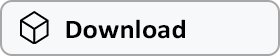
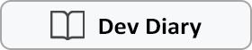
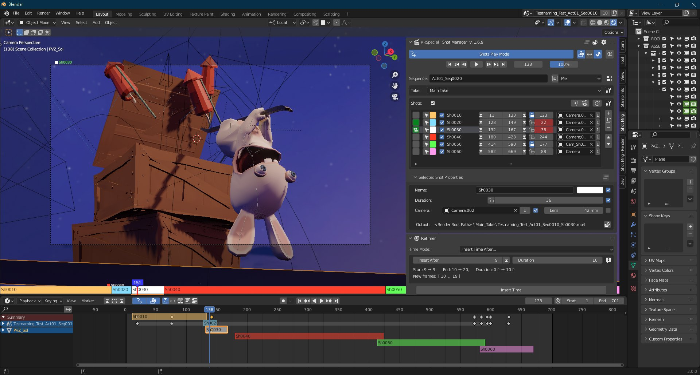

# Ubisoft Shot Manager - Blender Add-on

 

**Shot Manager is a Blender add-on that introduces a true shot entity in Blender scenes, as well as a wide and powerful set of tools to build and edit sequences in real-time directly in the 3D context.**

  
  &nbsp;&nbsp;&nbsp;
  
  &nbsp;&nbsp;&nbsp;
  
  &nbsp;&nbsp;&nbsp;
  

 

## Pre-releases
The latest pre-release version is: [Shot Manager V 2.0.102 Beta](https://github.com/ubisoft/shotmanager/releases/tag/v2.0.102_Beta)

## Disclaimer

>**This tool is currently supported for Blender 3.1, 3.0 and LTS 2.93**
>
>It was initially developed for an animated TV series production in 2020 on Blender 2.83. It has the features that were needed at the time but it
may not be considered as feature complete for a more generic purpose. In spite of all our efforts to make it reliable some troubles may occur in use cases we have not faced.

 

Note that development is on Windows 10. Please report issues and submit PRs for other OSs.

## Purpose

Manages the shots of a Blender scene. It offers a real-time editing directly on
the data of a 3D scene.
Shot Manager is very versatile and can be useful in many cases.
The main use case is this: A continuous action is set in a scene, then some cameras
are put at the appropriate places in the world and a shot is created for each one of
them in order to record the right segment of time.
This is very convenient for previz and 3D layout.

 

 

For installation, features, FAQ, user help please check the documentation here: [https://ubisoft-shotmanager.readthedocs.io](https://ubisoft-shotmanager.readthedocs.io)

## Dev notes

Follow the development and the date of the upcoming releases on [the wiki](https://github.com/ubisoft/shotmanager/wiki).

Various development notes related to the add-on itself, to the Git project or to the installation are available here: [Dev Notes](./doc/devnotes.md)

## History
[Change Log](./CHANGELOG.md)

# Support

The active support repository is on the [Shot Manager Github repository](https://github.com/ubisoft/shotmanager) which is part of the [Ubisoft open source](https://github.com/ubisoft) projects group.

# License and copyright

The original code is Copyright (C) 2022 Ubisoft.

All code of the `shotmanager` package is under the GPLv3 license.
