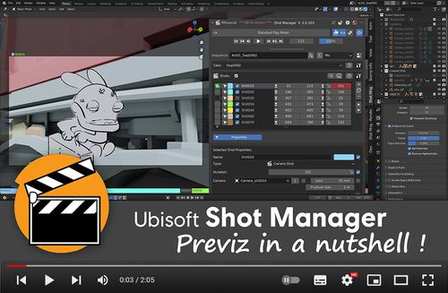
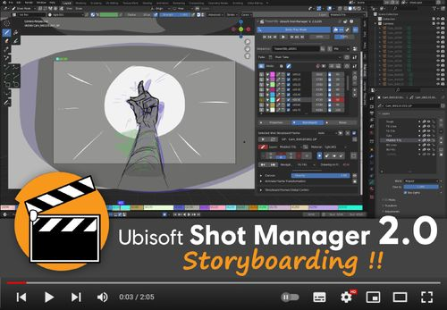
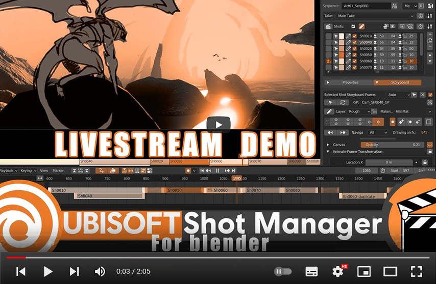

# Ubisoft Shot Manager - Blender Add-on

 
Shot Manager is NOT UNDER DEVELOPMENT ANYMORE *** It is currently maintained on Blender 3.3 LTS only, without futher improvements ***
 

**Shot Manager is a Blender add-on that introduces a true shot entity in Blender scenes, as well as a wide and powerful set of tools to build and edit sequences in real-time directly in the 3D context, in a non-linear way.**

 

  
  &nbsp;&nbsp;&nbsp;
  
  &nbsp;&nbsp;&nbsp;
  
  &nbsp;&nbsp;&nbsp;
  

## Disclaimer

> **This tool is only maintaned, not improved anymore.**
>
> Up do December 2022 this tool was made for Blender 2.93 LTS and 3.3 LTS.
>
> Please report isses you may face on the [Issues page](https://github.com/ubisoft/shotmanager/issues).
> 
> Since this add-on is not being developed anymore, only issues on the Blender versions mentioned above will be handled.

Note that development is on Windows 10. Reported issues and submitted PRs for other OSs are also appreciated.

## Purpose

Manages the shots of a Blender scene. It offers a real-time editing directly on
the data of a 3D scene.
Shot Manager is very versatile and can be useful in many cases.
The main use case is this: A continuous action is set in a scene, then some cameras
are put at the appropriate places in the world and a shot is created for each one of
them in order to record the right segment of time.
This is very convenient for previz and 3D layout.

  

With version 2.0 you can now start even earlier in production by drawing your own storyboard directly inside Blender 
and to smoothly convert the shots from 2D to 3D.

  

For installation, features, FAQ, user help please check the documentation here: [https://ubisoft-shotmanager.readthedocs.io](https://ubisoft-shotmanager.readthedocs.io)

## History
It was initially developed for an animated TV series production in 2020 on Blender 2.83. It received a lot of features and improvements since then.
It is currently used on several projects inside Ubisoft as well as on productions of various scales outside.

[Change Log](./CHANGELOG.md)

## Learning and tutorials
Even if Shot Manager doesn't have official video tutorials at the moment, it is still possible to get all the concepts and basics
thanks to the contributions of the users community.

  

## Pre-releases
Pre-releases and available beta versions appear in the [list of the release versions](https://github.com/ubisoft/shotmanager/tags) with a "beta" in their tag.

For major releases some aditional information about their content is provided here: [Pre-releases and Experimental](https://ubisoft-shotmanager.readthedocs.io/en/latest/experimental/experimental.html#experimental) 

## License and copyright
The original code is Copyright (C) 2022 Ubisoft.

All the code included in this depot and in the Ubisoft Shot Mmanager package is under the [GPLv3 license](https://www.gnu.org/licenses/gpl-3.0.html).

## Support
The active support repository is on the [Shot Manager Github repository](https://github.com/ubisoft/shotmanager) which is part of the [Ubisoft open source](https://github.com/ubisoft) projects group.

# Development, project and code

## API
If, as a script developer, you want to write some code that it not part of Shot Manager but that communicates with it, the [Shot Manager API](.api/doc/shot_manager_api.md) is made for you!

## Dev notes
Follow the development and the date of the upcoming releases on [the wiki](https://github.com/ubisoft/shotmanager/wiki).

  - [Shot Manager dev notes](./doc/devnotes_addon.md): Notes about the add-on itself, its architecture, dependencies

  - [Development Environment](./doc/development.md): Python venv, CI CD
  - [Releases](./doc/release.md): How to make a release
  - [Documentation](./doc/devdoc.md): How to update and generate the documentation with Sphinx and ReadTheDoc

## Contributions
The contribution process will be defined soon. At the moment and since we are still quite often refactoring a few things please
prefer opening an issue and discuss your need and expectations rather than submit a direct contribution.
