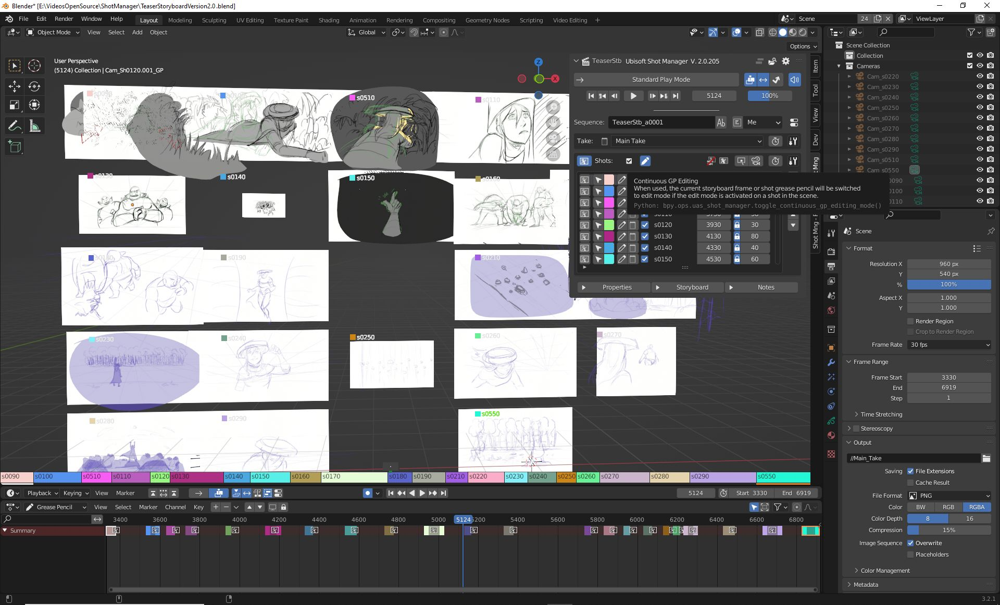
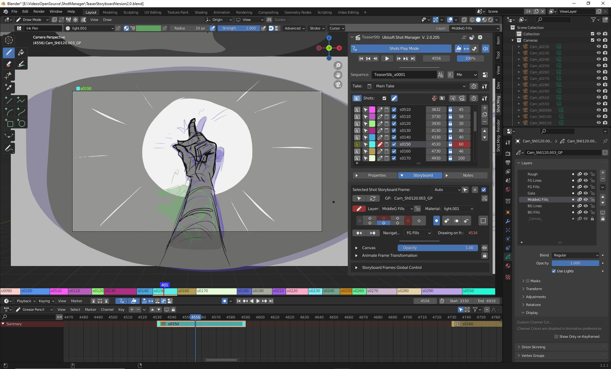
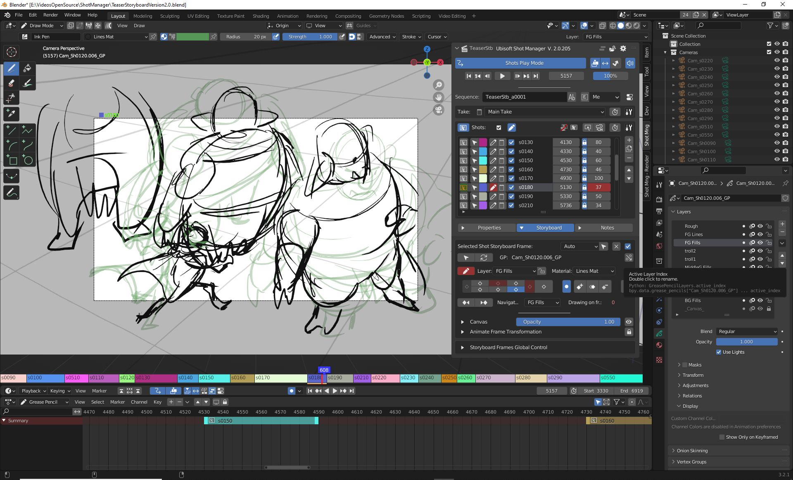

.. |br| raw:: html

   

..  image:: /img/ubisoft_logo.png
    :align: center

Ubisoft Shot Manager: Creative narration in Blender
===================================================

**Manage the cameras of your scenes inside** `Blender <https://www.blender.org/>`__. **and edit your sequence in real time and with great simplicity.**

**Current version is 2.1. The currently supported Blender versions are 3.3 LTS and 2.93 LTS**
|br|. . .and the documentation is still in development :D
|br|

.. image:: /img/V2_Banner_Docs.png
   :align: center

|br|

.. raw:: html

   

      <iframe width="560" height="316" src="https://www.youtube.com/embed/UEXOjY5ivkE" title="YouTube video player" frameborder="0" allow="accelerometer; autoplay; clipboard-write; encrypted-media; gyroscope; picture-in-picture" allowfullscreen></iframe>
   

    

**Check all the new features in** :ref:`What's new in 2.0<what-s-new-in-2-0>`

.. raw:: html

   

      <iframe width="560" height="315" src="https://www.youtube.com/embed/btLygAlD41c" title="YouTube video player" frameborder="0" allow="accelerometer; autoplay; clipboard-write; encrypted-media; gyroscope; picture-in-picture" allowfullscreen></iframe>
   

    
    

.. |img01| image:: img/ShotManager_PrevizScreen.jpg
   :align: middle
   :width: 99%

+---------+---------+---------+---------+
| |img01| | |img02| | |img03| | |img04| |
+---------+---------+---------+---------+

Disclaimer
----------

In spite of all our efforts to make it reliable some troubles may occur in use cases we have not faced.
Be aware that neither Ubisoft nor Ubisoft employees can be taken as responsible in case of data loss. Use it at your own risks.

**This said, we will do our best to listen to your feedback and improve this add-on accordingly in order to provide a robust and flexible production tool.
Please report your requests and issues you may face to the** `Issues page <https://github.com/ubisoft/shotmanager/issues>`__. **Have fun !**

   
Getting started
---------------

**It is highly recommended to start by reading the** :ref:`Shot Manager General Philosophy <general-philosophy>` **to clearly understand the purpose of this tool !**
   Then:

   * :ref:`Download <download>` the Shot Manager zip file,
   * :ref:`Install <installing>` Shot Manager as a Blender addon,
   * Mind the :ref:`features <features-and-limitations>` and the :ref:`vocabulary <glossary>`,
   * ...And at last :ref:`try out <first-steps>` your installation !

History
-------
Shot Manager is a pre-production tool that was initialy developed to support the previz of an animated TV series we did at Ubisoft between
January 2020 and February 2021. From the very beginning we knew we wanted to share it with the Blender community so we released it
as part of an open source project on GitHub during summer 2021. Since that time it is used internaly at Ubisoft as well as
by several animation production companies and individuals, and we keep supporting it.

Read this article to see how we used this tool on the TV production of Rabbids Invasion: Mission to Mars: `User Stories - Blender and the Rabbids <https://www.blender.org/user-stories/blender-and-the-rabbids/?utm_source=www-homepage>`__.

.. toctree::
   :maxdepth: 3
   :hidden:
   
   /getting-started/general-philosophy
   /what-s-new/what-s-new-in-2-1
   /what-s-new/what-s-new-in-2-0
   /what-s-new/release-change-logs

.. toctree::
   :maxdepth: 2
   :hidden:
   :caption: Getting started

   /getting-started/install
   /getting-started/first-steps
   /getting-started/glossary
   

.. toctree::
   :maxdepth: 3
   :hidden:
   :caption: Shot Manager Panel

   /main-panel/features
   /main-panel/main-panel
   /storyboard/storyboard

.. toctree::
   :maxdepth: 3
   :hidden:
   :caption: Features

   /feature-toggles/feature-toggles-list
   /overlay-tools/overlay-tools

.. toctree::
   :maxdepth: 3
   :hidden:
   :caption: Settings
   
   /settings/add-on-preferences
   /settings/project
   /settings/shots
   /settings/keymap
   

.. toctree::
   :maxdepth: 4
   :hidden:
   :caption: Rendering

   /rendering/rendering
   /rendering/stampinfo/stampinfo
   

.. toctree::
   :maxdepth: 2
   :hidden:
   :caption: How to...

   /how-to/how-to
   /how-to/how-to-toggle-features
   /how-to/use-in-production
   /how-to/tips

.. toctree::
   :maxdepth: 2
   :hidden:
   :caption: Troubleshooting

   /troubleshoot/faq
   /troubleshoot/issue

.. toctree::
   :maxdepth: 1
   :hidden:
   :caption: I want more

   /experimental/experimental
   /more/more-addons
